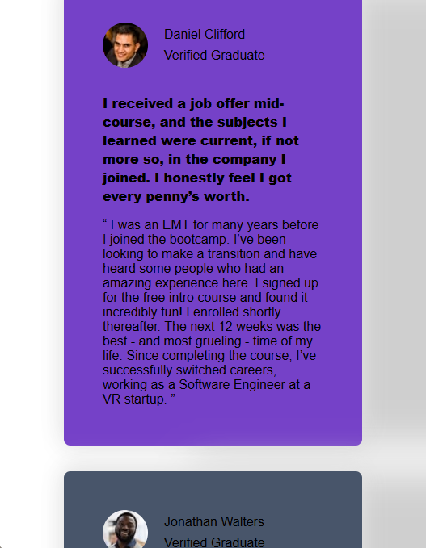
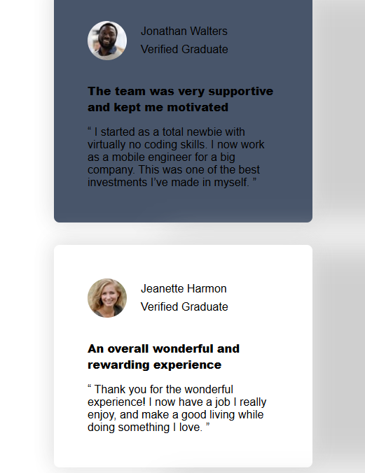
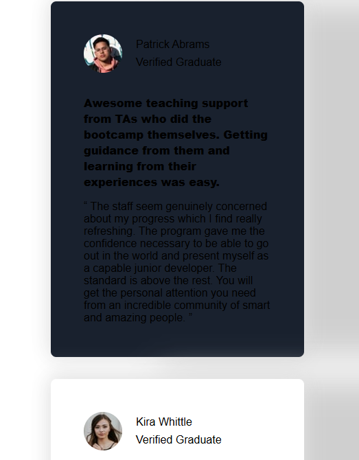
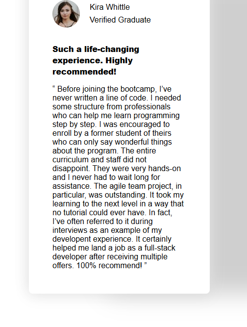

# Frontend Mentor - Testimonials grid section solution

This is a solution to the [Testimonials grid section challenge on Frontend Mentor](https://www.frontendmentor.io/challenges/testimonials-grid-section-Nnw6J7Un7). Frontend Mentor challenges help you improve your coding skills by building realistic projects. 

## Table of contents

- [Overview](#overview)
  - [The challenge](#the-challenge)
  - [Screenshot](#screenshot)
  - [Links](#links)
- [My process](#my-process)
  - [Built with](#built-with)
  - [What I learned](#what-i-learned)
  - [Continued development](#continued-development)
  - [Useful resources](#useful-resources)
  - [AI Collaboration](#ai-collaboration)
- [Author](#author)
- [Acknowledgments](#acknowledgments)

## Overview
  This project is on re-designing a basic testimonial webpage. I tests the prgrammers ability to re-design pages in detail.
### The challenge

Users should be able to:

- View the optimal layout for the site depending on their device's screen size

### Screenshot


  ## Mobile design screenshots
    
    
    
    

### Links

- Solution URL: [https://github.com/EmmanuelMahuwa/Testimonial-grid](https://your-solution-url.com)
- Live Site URL: [https://emmanuelmahuwa.github.io/Testimonial-grid/](https://your-live-site-url.com)

## My process
  With this project i feel my understanding of Html and css reaching a new level. Am a step closer to intermediate level.

### Built with

- Semantic HTML5 markup
- CSS custom properties
- Flexbox
- CSS Grid
- Mobile-first workflow
- [Styled Components](https://styled-components.com/) - For styles

### What I learned
I now have a better understanding of how using rem and em instead of px in your web-segn improve the responviseness of the page on different screen sizes. This also helped me in further understanding disply grid and flex.
examples: 
```css
    .body {
        padding: 5rem;
        display: grid;
        grid-template-columns: repeat(4, 1fr);
        grid-template-rows: repeat(2, 1fr);
        gap: 2rem;
        
    }
    .section {
        display: flex;
        justify-content: start;
        align-items: center;
        gap: 1.25rem;
        margin-bottom: 2rem;
        padding: 0;
    }
```


### Continued development
i feel i am not confortable with htnl and css. I would like to move on to javascript and grow towards being a full stack deeveloper.

### Useful resources
diplay layout helped and i will be using them going further.

### AI Collaboration

Describe how you used AI tools (if any) during this project. This helps demonstrate your ability to work effectively with AI assistants.

- What tools did you use (e.g., ChatGPT, Claude, GitHub Copilot)?
  The this project, i used chatgpt for ratting my code after i was done and then after the ratting i was able to identify that i needed to improve the programming a bit to get it to be as responsive as it can be.
- How did you use them (e.g., debugging, generating boilerplate, brainstorming solutions)?
  I used it for ratting the program. Basically identifying where i could do better.
- What worked well? What didn't?
  The ratting worked well because it helped me identify areas that neede improvement.

## Author

- Website - [Mazmigo](http://127.0.0.1:5500/proj-7/index.html)
- Frontend Mentor - [@EmmanuelMahuwa] (https://www.frontendmentor.io/profile/EmmanuelMahuwa)

## Acknowledgments

I would not have gotten this far in my design without previous knowledge i aquired from Frontend mentor.

# Testimonial-grid
